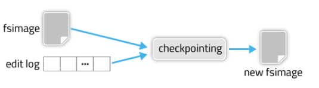
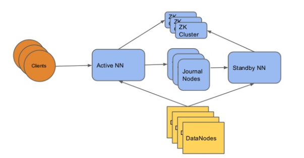

# Namenode HA for HDFS on K8s

## Goals

1. Adopt one of existing namenode HA solutions and make it fit for HDFS on K8s:
   There are two HA solutions: an old NFS-based solution, and a new one based on
   the Quorum Journal Service. We are leaning toward the journal-based solution.
   We’ll discuss the details below.
2. Keep HDFS on K8s easy to use: The current HDFS on K8s is known to be easy to
   set up, thanks to automations allowed by Kubernetes and Helm. We’d like to
   keep it that way even for the HA setup.

## Existing Namenode HA solutions
### Terminology

- Primary namenode: A central daemon used in a non-HA setup that maintains the
  file system metadata.
- Secondary namenode: The other namenode daemon instance used in a non-HA setup
  that runs along with the primary namenode. The secondary namenode creates new
  snapshots of namenode metadata by merging incremental updates.
- Active namenode: A namenode instance used in a HA setup that is in charge of
  maintaining the file system metadata.
- Standby namenode: The other namenode instance used in a HA setup that runs
  along with the active namenode. The standby namenode listens to metadata
  updates made by the active namenode and gets ready to take over in case the
  active namenode crashes. 

### Namenode metadata

The namenode daemon maintains the file system metadata such as which directories
have which files, file ownership, which datanode daemons have blocks of those
files, etc.

NN manipulates the metadata mostly in memory. But it has to persist them to
disks for **crash safety**. I.e. Avoid losing metadata when the NN crashes or
restarts.

There are two disk files that NN writes:
1. Snapshot of the metadata dumped at a time point in the past. This is called
   **fsimage**.
2. Incremental updates since the snapshot time point. In non-HA setup, the
   updates are appended to a local file called **editlog**. (In journal-based
   HA, editlog is stored on shared network service)

The editlog is later merged into a new fsimage snapshot, starting a new cycle.

Another important piece of metadata, the mapping of which datanodes have which
file blocks, is *not* written to disk. After restart, NN rebuilds this mapping
from datanode heartbeat messages. This takes a while and it is one of the
reasons why restarting NN is slow. 

### HA solution choices

In the HA setup, there are two NN instances: an active NN and a standby NN. The
active NN handles clients’ requests and modifies the filesystem metadata. The
modification goes to the editlog file. This editlog should be shared with the
standby NN so that it can also have up-to-date metadata and quickly become the
active NN when the prior active NN crashes.

Hadoop has two HA solutions, mainly based on how exactly the editlog is shared
with the standby NN:

1. An old NFS-based solution described at
   https://hadoop.apache.org/docs/stable/hadoop-project-dist/hadoop-hdfs/HDFSHighAvailabilityWithNFS.html.
   The editlog is placed in a NFS volume that both the active and standby NN
   have access to.
1. a new one based on the Quorum Journal Service at
   https://hadoop.apache.org/docs/stable/hadoop-project-dist/hadoop-hdfs/HDFSHighAvailabilityWithQJM.html.
   The Journal Service is zookeeper-like service that has an odd number of
   backing servers. The active NN writes to the journal service, while the
   standby listens to the service. For each metadata update, the majority of the
   journal servers should agree on the change.

The NFS approach has a flaw around the split-brain scenario. When both NNs think
they are active, they will write to the editlog simultaneously, corrupting the
file. So the NFS approach relies on forcibly shutting down one of the NNs.
(Called fencing) And this requires special HWs at the BIOS or power switch
level. Most people don’t like this extra requirement.

The Quorum Journal Service solves the split-brain issue at the service level.
The service only honors one writer at a given time point. So no need to have
special hardware for fencing. (Some soft fencing is still recommended to prevent
the rogue NN from continuing to serve lingering read clients) To use the journal
service, each NN host needs to run a client for it called Quorum Journal
Manager. The journal manager with an active NN registers with the journal
servers using a unique epoch number. Write requests come with the epoch number
and they will be rejected if their epoch number is smaller than the servers
expect. This way, they can reject requests from a rogue, previously active, NN
with old epoch number. More details can be found at
http://johnjianfang.blogspot.com/2015/02/quorum-journal-manager-part-i-protocol.html.

For HDFS on K8s, we are leaning toward the journal manager approach.

### Other HA aspects

The standby NN does one more thing. It also merges the editlog into a new
fsimage snapshot. And sends the new snapshot to the active NN via HTTP, so that
they can drop earlier updates in the editlog. (For non-HA setup, this can be
done by another special NN instance, called the **secondary** NN. But in HA, the
standby NN will do that for us)

We said earlier that the block-to-datanode mapping is not persisted. So
datanodes actually send heartbeats with the block mapping to both NNs, so that
the standby NN can become active right away.

Clients also are aware of both NNs. There is a client-side library that will
figure out who to talk to.

Automatic failover to a new active NN requires a zookeeper service, which needs
an odd number of instances. (This is in addition to the journal manager, which
is similar to zookeeper but not same). For this, the NN hosts should run an
extra zookeeper client called Zookeeper Failover Controller. The controller
monitors the health of the local NN and communicate with the zookeeper service
in the right way so that the failing active NN can release the zookeeper lock to
the standby NN.

## Namenode HA design for HDFS on K8s

So we need three K8s services for the HA setup.

1. Namenode service with two NNs
2. Journal service with an odd number of journal servers
3. Zookeeper with an odd number of servers.

For each of these, we’ll use a stateful set of a corresponding size. For
Zookeeper, we already have a helm chart in
https://github.com/kubernetes/contrib/tree/master/statefulsets/zookeeper. So we
can reuse it. Each Zookeeper server writes its data to a persistent volume.

For journal servers, we need to write a new helm chart. This can be modeled
after the zookeeper helm chart. This should be straightforward.

For NN, we have a helm chart for non-HA setup at
https://github.com/apache-spark-on-k8s/kubernetes-HDFS/tree/master/charts/hdfs-namenode-k8s,
which uses a statefulset of size 1. We can extend this to support HA setup as an
option. We’ll have to do the following work:

1. The statefulset size is currently one. Extend it to two.
2. Add all config options described at
   https://hadoop.apache.org/docs/stable/hadoop-project-dist/hadoop-hdfs/HDFSHighAvailabilityWithQJM.html.
   This includes the config key for using the Quorum Journal servers as editlog
   destination. 
3. Add a container to each NN pod for running the Zookeeper Failover Controller.
4. Optionally, use persistent volumes for storing fsimage files.

What is notably missing is support for fencing that we discussed above. We will
leave this as an open problem that we may address in a later version.

Item (4) is significant because the NN pod in the non-HA setup stores the
fsimage file on a HostPath volume. We also pins the NN to a particular K8s node
using a K8s node label to make sure a restarted NN can find the right fsimage
file. Hopefully, we can remove the HostPath and node pinning dependencies with
(4). But we want to keep the old behavior as an option, in case people want to
try HDFS on K8s on a very simple setup without persistent volumes and HA. 

People have to upgrade HDFS software version occasionally, like HDFS 2.7 to 2.8.
Sometimes the metadata format changes and NNs need to convert the metadata to a
new format. Unfortunately, the format upgrade is done in a non-symmetric way.
The active NN should do the format conversion and write the new metadata to the
journal service. Then the standby NN should sync with it upon start. The NN helm
chart for HA setup should support this in an automated fashion. We think we can
do that using an init container. We’ll address this in a later PR.
